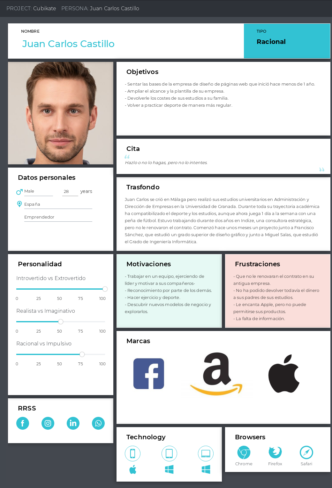
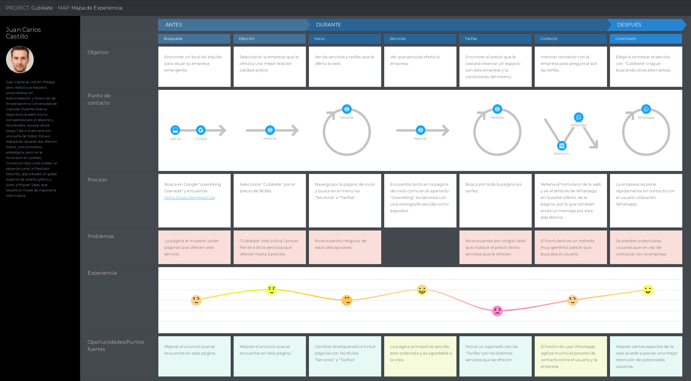
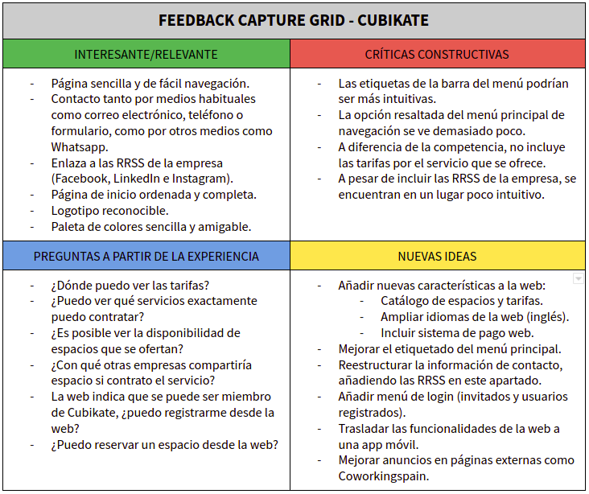

# Cubikate - UX Case Study
Este trabajo final INDIVIDUAL tiene como objetivo evaluar tu capacidad de aplicación
de las técnicas y metodologías de diseño centrado en usuario y UX a un caso real: el (re)diseño de la
web para una empresa de coworking, en este caso [Cubikate](https://cubikate.es), donde partimos de un diseño ya existente.

### Miembros del equipo

 * :bust_in_silhouette:  Guillermo Sandoval Schmidt - Estudiante de Ingeniería Informática en la UGR  
  - :octocat: [Gsandoval96](https://github.com/Gsandoval96)

### Descripción del proyecto

Para este caso práctico se ha decidido escoger la web de [Cubikate](https://cubikate.es) frente a la de [Errant](https://www.errant.es) debido a que con un vistazo inicial parece que esta cuenta con una página web que ya se basa en los **principios de simplicidad, claridad y consistencia**, suponiendo un reto mayor estudiar este caso y realizar una propuesta para mejorar la misma.

Además, debemos tener en cuenta el tiempo limitado del proyecto, siendo un *sprint* de **36 horas**.

Con esto en mente, se plantean los siguientes objetivos:

- Analizar la competencia, viendo que funcionalidades ofrecen otras webs de coworking frente a la nuestra.

- Analizar en profundidad la interfaz de usuario, realizando una **revisión de usabilidad** y un pequeño análisis de **diseño UX** para así encontrar los puntos fuertes y débiles de nuestra web.

- Realizar una **propuesta de valor** que mejore el diseño y/o funcionalidad de la web analizada.

---

# Análisis de la competencia

Para analizar la competencia de [Cubikate](https://cubikate.es) tendremos que entender qué es el *coworking* y comparar su web con otras que ofrezcan servicios similares.

## Fase 1: ¿Qué es el *coworking*?

El *coworking* es una forma de trabajo que permite a profesionales independientes, emprendedores, y pymes de diversos sectores, compartir un espacio de trabajo tanto físico como virtual, para desarrollar tanto proyectos independientes como proyectos conjuntos. Esta filosofía de trabajo tiene como objetivos principales el crear nexos entre profesionales de diversos sectores, reducir costes y fomentar ambientes cooperativos.

Las empresas de *coworking* ofrecen espacios de trabajo flexibles, que se adaptan a las necesidades de la empresa o usuario que las requiera, ofreciendo servicios como conexión wifi, espacios de reunión, espacios de *relax* etc. e incluso en algunos casos se ofrecen servicios de oficina virtual o asesoramiento económico.

## Fase 2: Cubikate vs Otras empresas

Vamos a proceder a comparar las funcionalidades y características de la web con la de otras empresas que ofrecen servicios de *coworking*.

### Cubikate

Por una parte, [Cubikate](https://cubikate.es) ofrece:

- Definición del coworking.
- Servicios.
- Salas de reuniones.
- Oficina virtual.
- Información de contacto (RRSS, localización, correo electrónico, teléfono)

### Otras empresas

Por otra parte, vamos a ver qué servicios incluyen otras empresas de *coworking* con sede en Granada como [Errant](https://www.errant.es) o [Andacowork](https://www.andacowork.com/) y otras con mayor repercusión a nivel nacional como [Utopicus](https://www.utopicus.es/), que cuenta con oficinas en Barcelona y Madrid.

#### Errant

[Errant](https://www.errant.es) añade respecto a nuestra web:

- **Tarifas**.
- Cambiar **idioma** (inglés y español).
- La Pecera Comunicación (ayuda específica para crear proyectos audiovisuales).

#### Andacowork

[Andacowork](https://www.andacowork.com/) añade respecto a nuestra web:

- **Tarifas**.
- Cambiar **idioma** (inglés y español).
- Blog.

#### Utopicus

[Utopicus](https://www.utopicus.es/) añade respecto a nuestra web:

- **Tarifas**.
- Catálogo de espacios.
- UtopicSchool (cursos para empresas).
- Cambiar **idioma** (inglés y español).
- Agenda con eventos.
- Blog.
- Login.

### Conclusiones

Una vez hemos visto varias empresas con servicios similares tanto a nivel local como estatal, podemos observar que la tónica general de las webs de *coworking* sirve como escaparate para mostrar un servicio y si queremos reservar el servicio ya tendríamos que contactar con la empresa.

Por otra parte, podemos ver que otras páginas de coworking cuentan con ciertas características como **tarifas** concretas para los diversos servicios o opción para utilizar la web en **otros idiomas**, en este caso, en inglés. Además, recalcamos que [Utopicus](https://www.utopicus.es/) cuenta con una opción de **login**, lo cuál puede ser un plus a la hora de crear una sensación de pertenencia a una comunidad.

Como norma general, todas las páginas analizadas cuentan con una presentación limpia y bien ordenada, con más información que funcionalidades.

---

# Análisis de la web

## Fase 3: Persona

En primer lugar vamos a crear una persona ficticia para ver como se desarrollaría el flujo de trabajo de un usuario que visitase la web.

## Fase 4: User Journey Map

Una vez hemos creado una persona ficticia, es hora de crear un mapa de experiencia con esta, para poder ver el ver el proceso por el que pasa el usuario al usar la web y poder detectar puntos fuertes y puntos débiles de la misma.

Con el mapa de experiencia podemos sacar los siguientes puntos fuertes y débiles:

- **Puntos fuertes**
  - Página de inicio sencilla y ordenada.
  - Contacto rápido mediante Whatsapp.
  - Diversos métodos de contacto (RRSS, correo electrónico, formulario web, teléfono, Whatsapp).

- **Puntos débiles**
  - Falta de información (tarifas).
  - Datos de contacto de RRSS poco visibles.
  - Menú principal con un etiquetado algo confuso.

## Fase 5: Usability Review

Hemos realizado una revisión de usabilidad, obteniendo una **valoración final de 75/100**. Durante el análisis de la misma hemos podido observar que contaba con un diseño basado en los principios de simplicidad, claridad y consistencia, por lo que todo lo relacionado con el diseño ha obtenido una buena puntuación alta. Por otra parte, al ser una página pequeña y sencilla, la navegabilidad es fácil de gestionar con un único menú. Por otra parte, hemos visto que varios de los items que contemplamos en el análisis no se pueden aplicar a esta web, consecuencia de la sencillez de la misma y de contar con un objetivo muy concreto, vender la idea de un servicio, que no el servicio, y poner en contacto a los usuarios con la empresa.

Como conclusión de este apartado podemos decir que la página web tiene pocas funcionalidades y características, pero lo poco que hace lo hace bien, de ahí una puntuación tan alta.

El documento completo se encuentra disponible [aquí](https://github.com/Gsandoval96/DIU-UGR/blob/master/Trabajo/doc/Usability-review-Cubikate.pdf).

---
## Fase 6: Feedback Capture Grid

A continuación, para completar y poder analizar la información que hemos obtenido en los Fases anteriores, se ha decidido realizar un *Feedback Capture Grid*, partiendo de la información obtenida en el análisis de la competencia, la revisión de usabilidad y la experiencia obtenida con nuestra persona ficticia.

De este modo agruparemos toda la información que hemos obtenido hasta el momento, facilitando el análisis de los puntos fuertes y débiles de la web y ayudando a encontrar nuevas propuestas e ideas para mejorar la web y el servicio.

---

# Propuesta de valor

A continuación vamos a realizar una serie de propuestas de mejora que dividiremos en propuestas de mejora UX para la web y otras propuestas de mejora.

## Fase 7: Mejora UX

### Mejora del diseño de la web

- **Opciones de idiomas:** observando a la competencia y entrando en un mundo globalizado, con el fin de no perder potenciales clientes no hispano-parlantes, se propone añadir la opción de cambio de idioma a la web, al menos al inglés.

- **Navegabilidad web:** las etiquetas del menú principal no siempre llevan exactamente a la información que espera el usuario, por lo que sería conveniente modificar el etiquetado. Además, la etiqueta resaltada que indica el apartado de la web en la que nos encontramos no se visualiza correctamente.

- **Contacto:** a pesar de que la web incluye las RRSS de la empresa, sería conveniente incluir esta información en el apartado de "Contacto", además de situarla en una barra inferior fija que sea de fácil acceso.

### Mejora de la funcionalidad y características de la la web

- **Menú con catálogo de espacios y tarifas:** observando a la competencia y basándonos en el mapa de experiencia del usuario que hemos creado, se observa la falta de un elemento imprescindible, y es información sobre las tarifas que ofrece la empresa.

- **Calendario de disponibilidad:** esta funcionalidad se propone para facilitar la planificación de las empresas que deseen reservar los servicios y los espacios.

- **Menú de login:** esta mejora se propone con el objetivo de crear comunidad, facilitando la sensación de pertenencia a Cubikate, inspirándonos en [Utopicus](https://www.utopicus.es/), una empresa de coworking a nivel nacional. Esta opción podría permitir a los usuarios identificados acceder a información extra como el calendario de disponibilidad de espacios.

- **Pagos integrados:** esta mejora es algo que no integran por norma general otras webs del mismo sector pero añadir esta opción puede mejorar la experiencia de los usuarios que realicen reservas puntuales de espacios. Analizándolo en profundidad, entendemos que esta opción no se contemple habitualmente por problemas legales asociados al arrendamiento de un espacio, por lo que habría que realizar un estudio de su viabilidad antes de implementarla.

### Otras mejoras

Además de las propuestas de mejora centradas en la web de [Cubikate](https://cubikate.es), se traen otras propuestas que puede mejorar la experiencia del usuario y la facilidad de captar potenciales usuarios:

- **Posicionamiento web:** como hemos podido comprobar, [Cubikate](https://cubikate.es) se encuentra atrás respecto a otras webs de la competencia en cuanto a posicionamiento web en navegadores como Google. Por ello se recomienda revisar este apartado, empezando por la mejora de los anuncios en páginas de búsqueda de empresas de coworking a nivel nacional como puede ser [Coworkingspain](https://coworkingspain.es/espacios/coworking/granada).

- **Desarrollo de una aplicación móvil:** en el caso de ampliar las funcionalidades de la web, se propone comenzar el desarrollo de una aplicación móvil que facilite el uso de los servicios ofertados a los usuarios registrados.

- **Estudio de accesibilidad web:** realizando un test rápido de accesibilidad web con una herramienta como [Wave](https://wave.webaim.org/) podemos comprobar que la web no cuenta con problemas de accesibilidad en aspectos como el contraste, pero que cuenta con múltiple errores y avisos para ser una página tan pequeña. Por eso se recomienda realizar un estudio en mayor profundidad para localizar y solucionar estos errores.

---

# Bibliografía y herramientas

- **Referencias**
  - [Wikipedia](https://es.wikipedia.org/wiki/Trabajo_cooperativo)
  - [Comunidad Coworking](http://www.comunidadcoworking.es/que-es-coworking/)

- **Páginas web**
  - [Cubikate](https://cubikate.es) - página analizada.
  - [Errant](https://www.errant.es) - página de la competencia.
  - [Andacowork](https://www.andacowork.com/) - página de la competencia.
  - [Utopicus](https://www.utopicus.es/) - página de coworking a nivel nacional.
  - [Coworkingspain](https://coworkingspain.es/espacios/coworking/granada) - página de búsqueda de empresas de coworking en España/Granada.

- **Herramientas**
  - [Uxforthemasses](http://www.uxforthemasses.com/wp-content/uploads/2011/02/Usability-review-template.xls) - Plantilla para la Usability Review.						
  - [Uxpressia](https://uxpressia.com) - Creación de persona ficticia y mapa de experiencia de usuario.
  - [Wave](https://wave.webaim.org/) - Estudio de accesibilidad web.

---

[![Creative Commons License][image-1]][1]  
This work is licensed under a [Attribution-NonCommercial-ShareAlike 4.0 International][1].

[1]:    https://creativecommons.org/licenses/by-nc-sa/4.0/deed

[image-1]:    https://licensebuttons.net/l/by-nc-sa/4.0/80x15.png
